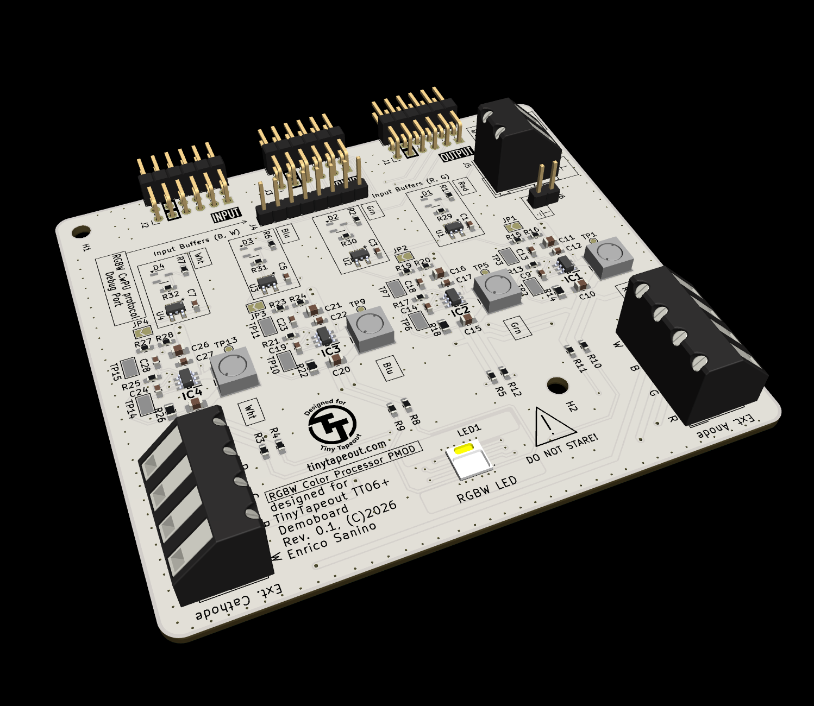

# tt-rgbw-pmod
An overkill PMOD to handle an RGBW LED for experimenting with the color rendering of the [thexeno/tt08-rgbw-controller](https://github.com/thexeno/tt08-rgbw-controller/ "tt08-rgbw-controller") ASIC. 
This PMOD matches with the [TinyTapeout/tt-demo-pcb](https://github.com/TinyTapeout/tt-demo-pcb "tt-demo-pcb").

## Overview

This PMOD board provides high-power LED driver capabilities for the tt08-rgbw-controller ASIC, featuring four independent channels for RGBW LED control with both digital PWM and analog dimming modes.

## Pinout

### PWM inputs (inputs PMOD side, outputs ASIC side)

| Pmod    | TinyTapeout | Function        | Note                  |
|---------|-------------|-----------------|-----------------------|
| OUTPUT1 | uo[0]       | Red PWM input   | Input impedance 100 kΩ|
| OUTPUT2 | uo[1]       | Green PWM input | Input impedance 100 kΩ|
| OUTPUT3 | uo[2]       | Blue PWM input  | Input impedance 100 kΩ|
| OUTPUT4 | uo[3]       | White PWM input | Input impedance 100 kΩ|
| OUTPUT5 - 8   | uo[4:7]           | Not connected   |                       |

### Inputs ASIC side

All "INPUT" pins are disconnected on the PMOD, not used. But the ASIC and the Demoboard are using them for the SPI communication, so signals are present if probed. See ASIC documentation.

### Colorwheel Debug Port

This applies only if enabled, see ASIC documentation.

| Pmod    | TinyTapeout | Function        | Note                  |
|---------|-------------|-----------------|-----------------------|
| BIDIR1 | uio_out[0]       | CwPU register bit 0   |  |
| BIDIR2 | uio_out[1]       | CwPU register bit 1 | |
| BIDIR3 | uio_out[2]       | CwPU register bit 2  | |
| BIDIR4 | uio_out[3]       | CwPU register bit 3 | |
| BIDIR5    | uio_out[4]           | CwPU register bit 4   |                       |
| BIDIR6    | uio_out[5]           | CwPU register bit 5   |                       |
| BIDIR7    | uio_out[6]           | CwPU register bit 6   |                       |
| BIDIR8    | uio_out[7]           | CwPU register bit 7   |                       |

## Getting Started

### Quick Setup Checklist

1. Select the control mode for each color channel using jumpers JP1–JP4:
  - Jumper bridged: Analog (LED-side) dimming mode
  - Jumper open: Digital (LED-side) PWM mode
2. Verify 3.3V power is available on the Demoboard's PMOD connector.
3. Connect the RGBW Color Processor board to the Demoboard.
4. Apply external power: Connect 6–20V to J4 or J5 (minimum 5V required to activate drivers).

### Using External LEDs

To use external LEDs instead of the onboard ones, open the following jumper connections:
- R3, R4, R5, R8, R9, R10, R11, R12

### Current Adjustment

Adjust the constant-current output via resistors:
- R14 (Red channel)
- R18 (Green channel)
- R22 (Blue channel)
- R26 (White channel)

Current calculation:
- Digital dimming mode: I = 0.1V / R (default: 75 mA)
- Analog dimming mode: I = 0.2V / R (default: 150 mA)

## Operating Modes

### Digital PWM Mode (Jumper Open)
- PWM PMOD pin frequency: < 1 kHz
- Lower current consumption
- Suitable for most applications

### Analog Dimming Mode (Jumper Bridged)
- PWM PMOD pin frequency: > 10 kHz (recommended: 50 kHz)
- Higher current capability
- For continuous operation at default settings (150 mA per channel), a small heatsink is recommended:
  - Base size: 7×7 mm
  - Thermal resistance: 30–40 °C/W
 
## Debugging Features

Breakout to CwPU protocol 8-bit interface. Comply with the  debug interface.

## Electrical Characteristics

| Parameter                                      | Min | Typ | Max | Unit | Notes                      |
|-----------------------------------------------|-----|-----|-----|------|----------------------------|
| External supply voltage                        | 6   | 12  | 20  | V    | Required (J4 or J5)        |
| External supply current                        | -   | -   | 400 | mA  | 2W total max               |
| PMOD Logic VDD                        | 3.0   | -   | 5.0 | V  | To handle correctly analog or digital dimming detection               |
| Logic input voltage                            | -   | 3.3 | -   | V    | TTL compatible             |
| LED current (Digital mode)                     | -   | 75  | -   | mA   | Per channel, default       |
| LED current (Analog mode)                      | -   | 150 | -   | mA   | Per channel, default       |
| PWM input for Digital mode           | -   | -   | 1   | kHz  | Maximum recommended        |
| PWM input for Analog mode            | 10  | 50  | -   | kHz  | Minimum / recommended      |
| VIL                                     | -  | 0.8  | - | V  | LVTTL     |
| VIH                                       | -  | 2.0  | - | V  | LVTTL     |

